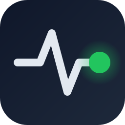
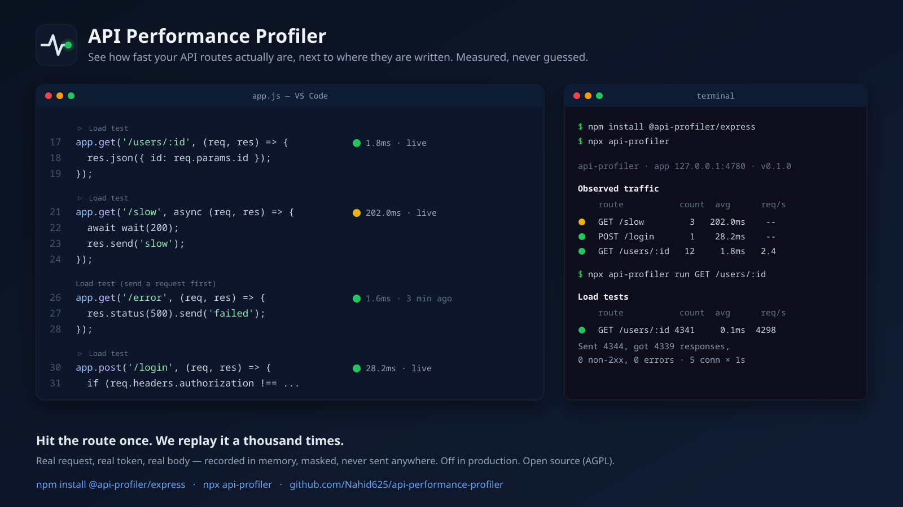

<p align="center"></p>

# API Performance Profiler

**Local-first API performance profiler for Node.js — route latency, request recording, and load testing directly inside VS Code.**

[](https://npmjs.org/package/@api-profiler/express)
[](https://www.gnu.org/licenses/agpl-3.0)
[](https://marketplace.visualstudio.com/items?itemName=nahid625.api-profiler-vscode)

<p align="center">
  
</p>

Lightweight API performance profiling for Node.js services. It measures real request timings and status codes as they happen and aggregates them into per-route metrics. 


**The core idea: hit the route once, we replay it a thousand times.** The middleware sees the real request — the working token, the path param that exists, the body the route accepts — records it in memory, and can replay it under load. The results show up in the terminal or right next to the route in VS Code.

## Why?

As backend developers, we often fly blind when building APIs locally. You write a route, but you don't really know how fast it runs until you leave your editor, set up Postman, or configure a heavy APM tool. 

We wanted performance testing to feel native and frictionless. This tool brings metrics exactly where you need them: right inside your code editor.

## Features

- **VS Code integration:** Inline latency and a dedicated sidebar.
- **Local load testing:** Replay recorded requests 1,000 times with one click.
- **Route-level latency:** See real-time execution speeds.
- **Error-rate tracking:** Spot failing endpoints instantly.
- **Request recording:** Captures headers, bodies, and paths in-memory automatically.
- **Express & NestJS integration:** Drop-in middleware/interceptor.
- **CLI:** A fast, terminal-based dashboard.

## Quick Start: The VS Code Extension (Recommended)

The absolute best way to experience the API Performance Profiler is through our VS Code Extension. It brings metrics directly into your editor and even helps you set up the middleware!

1. **Install the extension:** Search for "API Performance Profiler" in the VS Code Marketplace.
2. Open a project containing your Express or NestJS routes.
3. The extension will show a warning if the profiler is not installed, and will guide you to add it with **1-click**.

Once connected, the extension provides:
- **Inline Latency:** See live metrics like `🟢 84.0ms` directly next to your route definitions (`app.get('/users')`).
- **One-click Load Testing:** Click the `▶ Load test` CodeLens above any route to instantly replay it in the background.
- **Routes Sidebar:** A dedicated view showing all observed routes in real-time, sorted slowest-first.

## Manual Setup (Without VS Code)

If you prefer to install it manually or use the CLI:

1. Install the package for your framework:
```bash
npm install @api-profiler/express
# or
npm install @api-profiler/nestjs
```

2. Attach it to your app:

**Express:**
```js
const express = require('express');
const { profiler } = require('@api-profiler/express');

const app = express();
app.use(profiler());
app.listen(3000);
```

**NestJS:**
```ts
import { ProfilerInterceptor } from '@api-profiler/nestjs';

const app = await NestFactory.create(AppModule);
app.useGlobalInterceptors(new ProfilerInterceptor());
await app.listen(3000);
```

3. Run your app, make a request, and see the results!

## 30-Second Example

1. Start your API with the profiler attached.
2. Hit an endpoint: `curl http://127.0.0.1:3000/users/1`
3. Instantly see `🟢 1.5ms` appear next to the route definition in VS Code!
4. Click `▶ Load test` above the route to stress test it.

*(See `scripts/demo.sh` for a terminal recording script).*

## CLI Dashboard

If you don't use VS Code, you can use the terminal alternative while your app is running:

```bash
npx api-profiler                        # live table, refreshed every second
npx api-profiler run GET /users/:id     # replay the recorded request under load
npx api-profiler routes                 # routes seen so far
```

## Request Recording / Replay

Locally, the profiler keeps the most recent successful request for each route — including its auth headers — so it can be replayed later for load testing. **Recordings live in memory only** and are masked wherever they are displayed.

Recording is ON only when `NODE_ENV` is unset, `development` or `test`. 
**Set `NODE_ENV=production` on your production servers.** It completely disables recording.

## Benchmarks

We designed this profiler to be as lightweight as possible. In synthetic benchmarks using `autocannon` (100 concurrent connections for 5 seconds on a trivial Express JSON endpoint), the profiler adds less than **7ms** of median latency (p50).

| Setup | p50 Latency | Throughput (Req/s) |
|---|---|---|
| **Without Profiler** | ~13ms | ~6,000 |
| **With Profiler** | ~20ms | ~3,500 |

*Run on Node.js v22. You can verify these numbers yourself by running `node benchmarks/run.js` in the repository.*

## Packages

This is an npm workspaces monorepo:

| Package | What it is |
|---|---|
| `api-profiler-vscode` | The VS Code extension. |
| `@api-profiler/express` | The middleware for Express. |
| `@api-profiler/nestjs` | The interceptor for NestJS. |
| `api-profiler` | Terminal CLI dashboard. |
| `@api-profiler/core` | Internal: types, store, aggregator. |
| `@api-profiler/node` | Internal: recorder, load runner, local channel. |

## Contributing

See [CONTRIBUTING.md](CONTRIBUTING.md) for instructions on running the mono-repo locally, running tests (`npm run verify`), and submitting PRs.

## License

AGPL-3.0-only. Free to use, modify and self-host; if you offer a modified version as a network service, you must publish its source under the same license. Copyright (c) 2026 Nahid.
